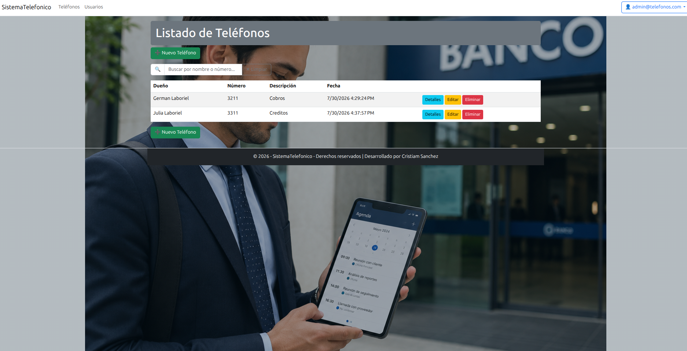
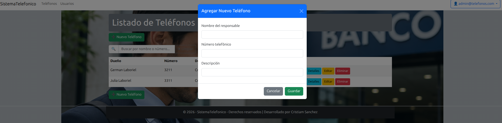
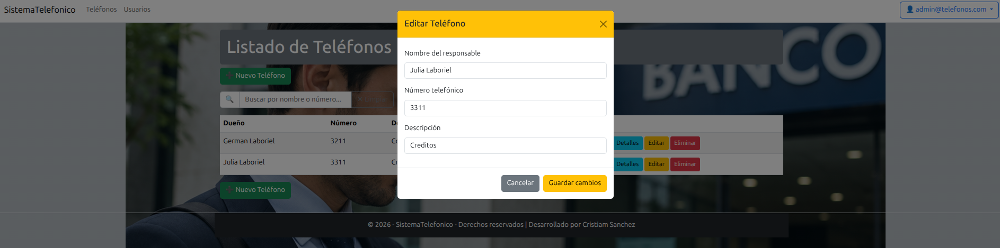
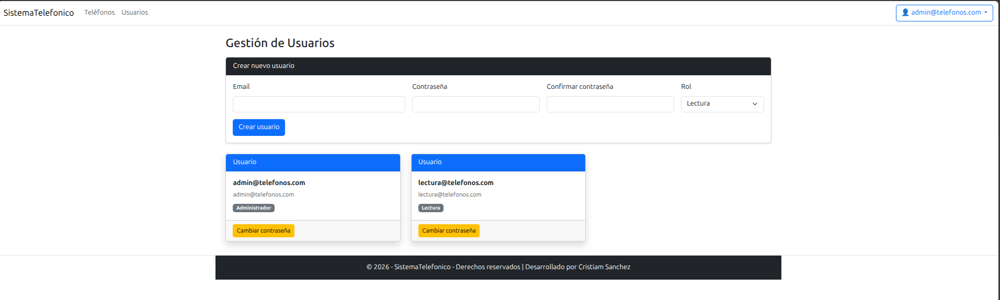

# SistExtensionesTel

[](https://github.com/CristiamSanchez/SistExtensionesTel/actions/workflows/dotnet-build.yml)
[](https://learn.microsoft.com/aspnet/core/)
[](https://docs.docker.com/compose/)

Aplicación web para gestionar extensiones telefónicas con ASP.NET Core MVC, ASP.NET Identity y SQL Server. Este proyecto funciona como una pequeña solución CRUD con validaciones de negocio, autenticación y entorno reproducible con Docker.

## ✨ Proyecto en una frase

Un proyecto práctico para consolidar el uso de MVC, Identity, Entity Framework Core, SQL Server y Docker en un flujo real de desarrollo.

## 🧩 Qué muestra este repositorio

- CRUD completo de extensiones telefónicas
- autenticación y autorización con ASP.NET Identity
- acceso a datos con Entity Framework Core
- base de datos inicializada de forma reproducible con SQL Server
- ejecución local y de demo con Docker Compose

## 🖼️ Screenshot gallery

### Home



### Login


### Crear



### Editar



### Usuarios



## 🧭 Demo flow

1. Clona el repositorio.
2. Crea un archivo `.env` con las variables de entorno recomendadas.
3. Ejecuta:

```bash
docker compose -f SistemaTelefonico/compose.yaml up -d --build
```

4. Abre la app en `http://localhost:8091`.
5. Inicia sesión o registra una cuenta.
6. Crea una extensión, edítala y valida el flujo completo.
7. Prueba el caso de número duplicado para mostrar la validación de negocio.

## ⚙️ Requisitos

- Docker Desktop o Docker Engine
- Docker Compose
- .NET SDK 10

## 🔐 Variables de entorno

Ejemplo de configuración segura para correr el proyecto localmente:

```env
MSSQL_SA_PASSWORD=YourStrongPassword123!
APP_DB_USER=appuser
APP_DB_PASSWORD=ChangeMe123!
```

## 📘 Qué aprendí con este proyecto

Este proyecto me permitió practicar de forma integral la construcción de una app web con:

- ASP.NET Core MVC y Razor
- ASP.NET Identity para autenticación
- Entity Framework Core y SQL Server como capa de persistencia
- Docker Compose para encapsular la base de datos y la app
- GitHub Actions como base de validación automática de build

## 🧪 Validación de build

La compilación de la app se validó con:

```bash
dotnet build SistemaTelefonico/SistemaTelefonico.csproj --configuration Release
```

La verificación realizada confirmó que el proyecto compila correctamente.

## 🔒 Recomendaciones para publicar en GitHub

No publiques contraseñas reales. Usa `.env` local o secretos de despliegue para evitar exponer credenciales sensibles.

## 📝 Release Notes

### v1.0 - Portfolio Edition

- CRUD funcional con validaciones de negocio
- autenticación con Identity
- integración con SQL Server y Docker Compose
- documentación orientada a GitHub y portfolio
- CI básica con GitHub Actions
